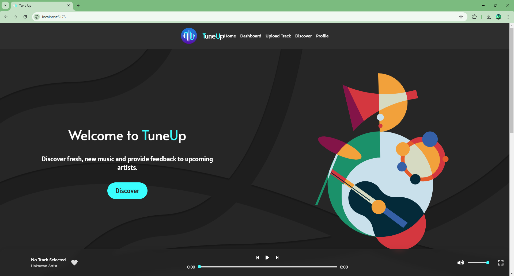
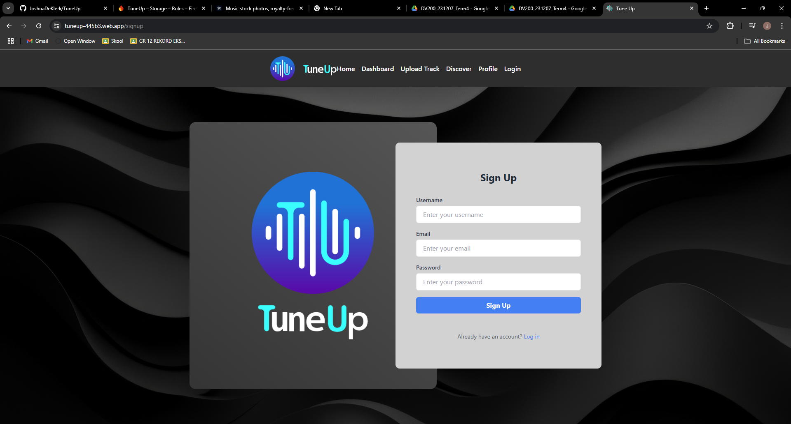
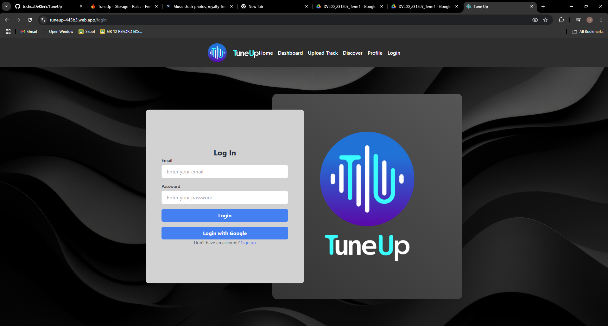

- - - -

## Table of Contents

1. [About Tune Up](#about-tune-up)
2. [Built With](#built-with)
3. [How To Install](#how-to-install)
   - [Step 1: Clone the Repository](#step-1-clone-the-repository)
   - [Step 2: Setting Up the Environment](#step-2-setting-up-the-environment)
   - [Step 3: Firebase Setup](#step-3-firebase-setup)
   - [Step 4: Running the Project Locally](#step-4-running-the-project-locally)
   - [Step 5: Deploying to Firebase Hosting](#step-5-deploying-to-firebase-hosting)
4. [Features](#features)
5. [The Idea](#the-idea)
6. [Development Process](#development-process)
   - [Highlights](#highlights)
   - [Challenges](#challenges)
7. [Future Implementations](#future-implementations)
8. [Mockups](#mockups)
   - [Register Mockup](#register-mockup)
   - [Login Mockup](#login-mockup)
   - [Home Mockup](#home-mockup)
9. [Other Resources](#other-resources)
10. [License](#license)
11. [Author](#author)
12. [Contact](#contact)
13. [Acknowledgements](#acknowledgements)

- - - -

# About Tune Up

TuneUp is a music platform where emerging artists can upload their music, gain feedback, and interact with a community of listeners. Designed with simplicity and functionality in mind, TuneUp allows users to explore fresh sounds and new artists in an engaging way.

### Built With.
[](https://www.php.net/docs.php)
[](https://www.php.net/docs.php)
[](https://html.spec.whatwg.org/multipage/)
[](https://developer.mozilla.org/en-US/docs/Web/CSS)
[](https://www.javascript.com/)
[](https://getbootstrap.com/)



## How To Install

### Step 1: Clone the Repository

To get started, clone the repo:
```bash
git clone https://github.com/JoshuaDeKlerk/TuneUp.git
```

### Step 2: Setting Up the Environment

1. **Install Node.js and Vite:**
   - Download and install Node.js from [Node.js](https://nodejs.org/en).
   - Install Vite for local development by running:
```bash
npm install -g vite
```

2. **Move to Project Directory:**
```bash
cd TuneUp
```

3. **Install Dependencies:**
```bash
npm install
```
### Step 3: Firebase Setup

1. **Firebase Configuration:**
   - Set up Firebase by creating a project at [Firebase Console](https://console.firebase.google.com/u/0/).
   - Enable Firebase Authentication, Firestore, and Hosting.

2. **Environment Variables:**
    -   Create a `.env` file in the root directory and add your Firebase configuration keys:
```bash
VITE_FIREBASE_API_KEY=YOUR_API_KEY
VITE_FIREBASE_AUTH_DOMAIN=YOUR_AUTH_DOMAIN
VITE_FIREBASE_PROJECT_ID=YOUR_PROJECT_ID
VITE_FIREBASE_STORAGE_BUCKET=YOUR_STORAGE_BUCKET
VITE_FIREBASE_MESSAGING_SENDER_ID=YOUR_SENDER_ID
VITE_FIREBASE_APP_ID=YOUR_APP_ID
```

3. **Build the Project:**
```bash
npm run build
```

### Step 4: Running the Project Locally
- To start the development server:
```bash
npm run dev
```

- Then, open http://localhost:5173 to view it in your browser.

### Step 5: Deploying to Firebase Hosting
- To deploy the project to Firebase Hosting:
```bash
firebase deploy
```

## Features

| Page                  | Description                                        |
| --------------------- | -------------------------------------------------- |
| Register Page           | 	- Allows new users to sign up        
| Login Page           | - Allows users to log in and access platform features        |
| Home Page             | 	- Displays featured music and user recommendations      |
|                       | - Users can explore and play music directly|                       | - Can access the settings page and logout |
| Upload Page       | - Artists can upload music tracks with cover images |
| Discover Page      | - Discover new music and popular tracks              |
| Profile Page     | - Users can view and edit profile details         |
| Music Player  | -  Interactive music player with volume and full-screen options       |

## The Idea

The idea behind TuneUp is to create a unique space for emerging artists to upload their music and gain recognition, while listeners can explore new sounds and interact with upcoming artists. The platform prioritizes user experience with a minimalist interface that makes it easy to navigate and interact.

### Register Page


### Login Page


### Home


## Development Process

### Highlights
* User-friendly UI: Minimalist design that makes it easy to explore and play music.
* Interactive Music Player: A fully functional music player with play, pause, volume control, and full-screen mode.
* Firebase Integration: Real-time updates for music uploads and user profiles.

### Challenges
* Real-time Data Management: Synchronizing user uploads and profile updates with Firestore.
* Responsive Design: Ensuring the player and interface elements work seamlessly across devices.
* Continuous Deployment: Integrating GitHub workflows for smooth CI/CD deployment.

## Future Implementations

* Playlist Feature: Allow users to create and manage playlists.
* Social Sharing: Enable sharing of tracks on social media.
* Enhanced Search: Filter music by genre, mood, or artist.
* Album Feauture

## Mockups

### Register Mockup


### Login Mockup


### Home Mockup


## Other Resources
- **Demonstration Video** - [Link To Demonstration Video](https://drive.google.com/drive/folders/1m_tC4c0sFXg-lnwuAZ45O8F0-i4G70YS?usp=drive_link)
- **Open Brief proposal** - [Link To Document](https://docs.google.com/document/d/1Z9u30rvw_OsQqcAf7lOFD0SmyR_O8vRFqhsPCvQg1Fc/edit?usp=sharing)
- **Milestone Check Document** - [Link To Document](https://docs.google.com/document/d/1CQG45TnFPoYjGDCC_h9VJs02m_N43LY3K8i97HZn4Qk/edit?usp=sharing)


### License
[MIT](LICENSE) © Joshua De Klerk

## Author

- **Joshua De Klerk** - [Github](https://github.com/JoshuaDeKlerk)

## Contact

- **Joshua De Klerk** - [231204@virtualwindow.co.za](mailto:231204@virtualwindow.co.za)
- **Project Link** - https://github.com/JoshuaDeKlerk/TuneUp 
- **Web Link** - https://tuneup-445b3.web.app/

## Acknowledgements

- [Stack Overflow](https://stackoverflow.com/)
- [Figma](https://www.figma.com/)
- [Lecturer](https://github.com/TsungaiKats)
- [Adobe Stock](https://stock.adobe.com/za/)